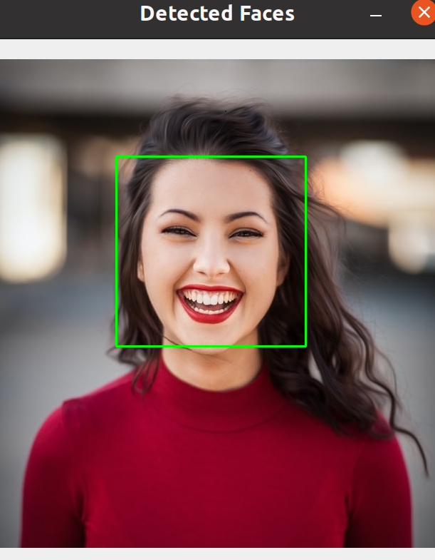
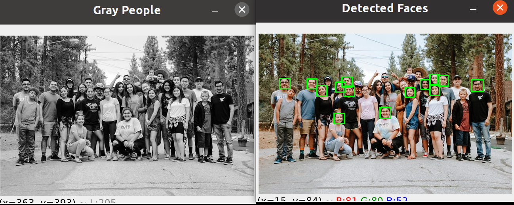
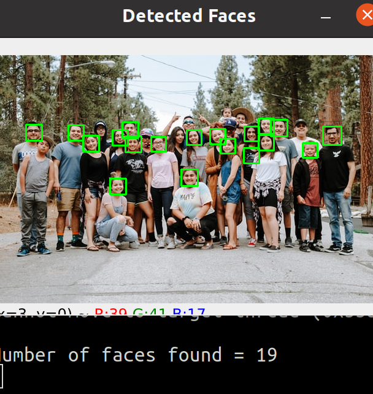
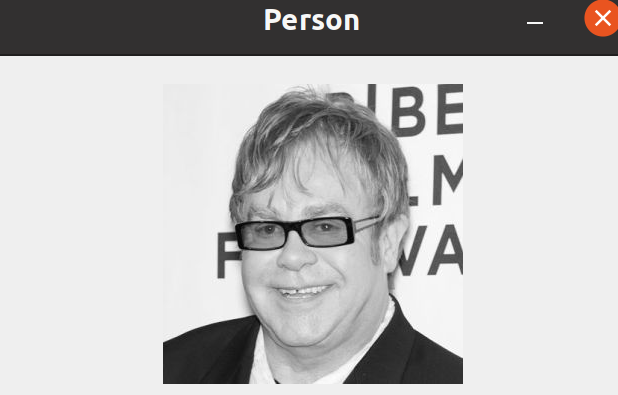

# 3 Faces Detection

1. [Cargar el archivo Haar_face.xml ](#schema1)
2. [Crear faces_rect](#schema2)
3. [Obtener el número de caras](#schema3)
4. [Detectar las caras con un rectángulo verde](#schema4)
5. [Face Recognition with OpenCV's built-in recognizer](#schema5)

# 1. Cargar el archivo haar_facel-xml

Para detectar objetos se necesita un clasificador. ¿Significa esto que tendremos que entrenar nuestro propio clasificador de rostros? ¡Qué va! OpenCV ya nos proporciona varios clasificadores en formato .xml que están preparados para reconocer cosas como rostros, manos, siluetas humanas, etc.
De esta página se pueden descargas más clasificadores (https://github.com/opencv/opencv/tree/master/data/haarcascades)

(https://robologs.net/2020/05/05/deteccion-y-reconocimiento-facial-con-opencv-python-y-facerecognition/)

Para esta coso vas a usar `haar_face.xml`
~~~python
haar_cascade = cv.CascadeClassifier('haar_face.xml')
~~~

# 2. Crear faces_rect

~~~pytho
faces_rect = haar_cascade.detectMultiScale(gray, scaleFactor=1.1, minNeighbors=3)
~~~

# 3. Obtener el número de caras

~~~python
print(f'Number of faces found = {len(faces_rect)}')
~~~

# 4. Detectar las caras con un rectángulo verde

~~~python
for (x,y,w,h) in faces_rect:
    cv.rectangle(img, (x,y), (x+w,y+h), (0,255,0), thickness=2)
~~~

Modificando el `minNeighbors` obtenemos mas caras
~~~python
faces_rect = haar_cascade.detectMultiScale(gray, scaleFactor=1.1, minNeighbors=1)
~~~

# 5. Face Recognition with OpenCV's built-in recognizer
1º Creamos  `create_train()`
~~~python
features = []
labels = []

def create_train():
    for person in people:
        path = os.path.join(DIR, person)
        label = people.index(person)

        for img in os.listdir(path):
            img_path = os.path.join(path,img)

            img_array = cv.imread(img_path)
            if img_array is None:
                continue 
                
            gray = cv.cvtColor(img_array, cv.COLOR_BGR2GRAY)

            faces_rect = haar_cascade.detectMultiScale(gray, scaleFactor=1.1, minNeighbors=4)

            for (x,y,w,h) in faces_rect:
                faces_roi = gray[y:y+h, x:x+w]
                features.append(faces_roi)
                labels.append(label)

create_train()
~~~

2º Entrenamos el reconocedor
~~~python
face_recognizer = cv.face.LBPHFaceRecognizer_create()
face_recognizer.train(features,labels)
~~~

3º Guardamos los archivos
~~~python
face_recognizer.save('face_trained.yml')
np.save('features.npy', features)
np.save('labels.npy', labels)
~~~

4º Creamos el archivo para reconocer las caras  y cargamos lo archivo creados anteriomente.

~~~python
features = np.load('features.npy', allow_pickle=True)
labels = np.load('labels.npy')

face_recognizer = cv.face.LBPHFaceRecognizer_create()
face_recognizer.read('face_trained.yml')
~~~

5º Cargamos una imagen nueva
~~~python
img = cv.imread(r'./Faces/val/elton_john/1.jpg')

gray = cv.cvtColor(img, cv.COLOR_BGR2GRAY)
cv.imshow('Person', gray)
~~~

6º Detectamos la cara en la imagen
~~~python
faces_rect = haar_cascade.detectMultiScale(gray, 1.1, 4)
~~~